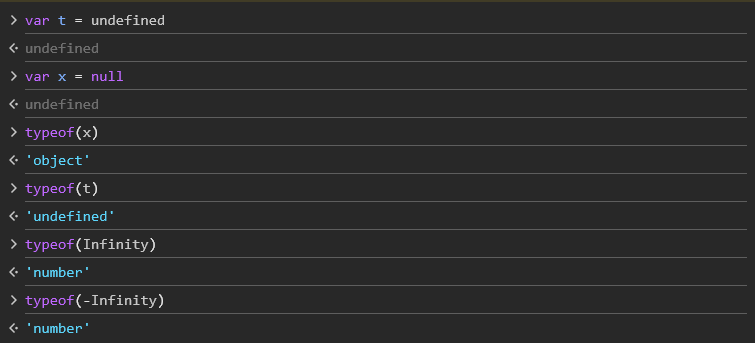
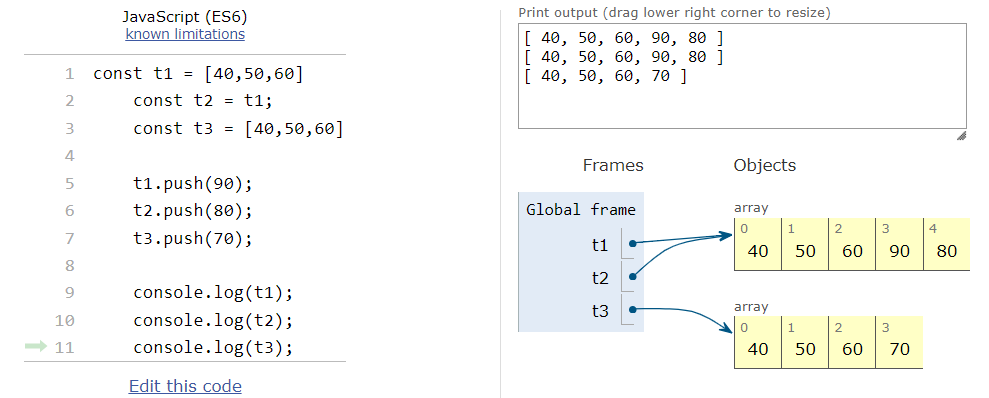

## Types of Data Types in Js

1. Number
2. String
3. Boolean
4. Object
5. Undefined (null)

## Number

var x = 10  
typeof(x) --> number

## String

var y = "String"  
typeof(y) --> String

## Arrays and Dictionaries

These 2 comes under object data type as they have key value pair
For arrayas key is the index.
example :

```js
var x = { name: "Js", version: "Es24" };
Typeof(x);
Output: "Object";

var y = [10, 20, 30];
Typeof(y);
Output: "Object";
```

## Special Data Types

> Undefined and Null



## To access values in dictionaries

1. Dot method
2. Box Method

Ex:

```js
var x = {no : 1, name : "XYZ"} ;
x.name or x['name']
```

## Re-Declation & Re-Assignment

Var - RA & RD  
let - RA  
const - None

**Note :** We can change the values in the array but cannot change the addresses of assigned values.



## Why null is object?

Its a bug. But if we fix the bug lot of projects will get disturbed.

## Scope

Life time of a variable  
Boundary  
The area where the variable can be accessed  
The area where the variable is alive

### {} - Block

Any variable cannot leak out of function block

## Var & Let

Var can be declared and accessed globally. Let can be declared globally, but its access is limited to the block in which it is declared. Variables declared using var can be re-declared and updated within the same scope. Variables declared with let can be updated but not re-declared within the same scope

|             | Var    | Let    |
| ----------- | ------ | ------ |
| Declaration | Global | Global |
| Accessing   | Global | Local  |

## Undefined & Not Defined

Undefined - Value  
Not Defined - Error

## Scope - Scenario

```js
function adult(age) {
  //Change the declaration to var to escape the error
  if (age > 18) {
    let msg = "Adult";
  } else {
    let msg = "Child";
  }
  console.log(msg);
}
```

The above code encounters 'Not defined' error. To escape this error  
There are 3 ways

1. Declaring variable right after function opening and the assign the values in the scope of if and else
2. Change the declaration as 'Var' so that it can be accessed throughout the function block
3. Write separate console in each the blocks.

## TypeCasting

```js
//Implicit TypeCasting
var x1 = 3;
var x2 = "5";
console.log(x1 + x2);
console.log(x1 - x2);

//Explicit TypeCasting
var x1 = 3;
var x2 = "5";
console.log(x1 + parseInt(x2));
console.log(x1 - +x2);
```

Implicit Type Conversion — automatically done during code execution by JavaScript engine. It is usually done when some operation is done on operands of different data types.  
Explicit Type Conversion — done manually by humans

- ### Edge case

  1.  Array + String = String
  2.  Array + Array = String
  3.  null + number = Number
  4.  number \* string = number
  5.  number \* string(char) = NaN

      Examples :

      ```js

      [2,3,4] + "abc"
      Output : '2,3,4abc'

      [] + []
      Output : ""

      null + 5
      Output : 5

      4 * '5'
      Output : 20

      4 * '5a'
      Output : NaN
      typeof(NaN) = number

      ```

- ### Checking
  == & ===
  There is cohesion involved in ==, means it converts string to number to check the values.  
   There is no cohesion involved in ===.  
   Thats the case, Strict Equalto(===) executes faster than Equalto(==)

## Types of Functions

The main motto is DRY (Dont Repeat Yourself)

- Normal Function
- Arrow Function
- Anonymous Function 
#### Parameter Vs Argument
  Argument - The value passed to the function while calling  
   Parameter - The value passed to the function while declaring 
   ### Normal Function
  A function which will written using the keyword 'function func_name()'.
  ```js
    function mul(n){
        return n*2; //return is compulsory otherwise it is undefined
    }
    console.log(mul(5));
  ```
  - 2 ways to exit the function 
  1. With 'return' keyword 
  2. After executing all the lines it will automatically end 
  
  ### Arrow Function
  ```js
  //Arrow Funtions
  const double = (n) =>{ //longer version
  return n*2;
  }
  const double1 =(n) => n*2; // shorter version
  console.log(double(3));
  console.log(double1(4));
  ```
