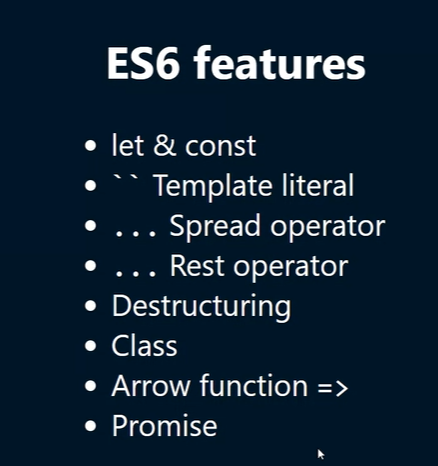

## Loops
### For loops
1. For loop (Traditional)  
for (var_name = value; condition; Increment/Decrement){  
    //statements  
}
```js
const marks = [80, 90, 100];

// More Control over the loop
for (let i = 0; i < marks.length; i++) {
  console.log("Index : " + i + ", Marks : " + marks[i]);
}

// Readable and simple - in stands for index
for (let idx in marks) {
  console.log("Index : " + idx + ", Marks : " + marks[idx]);
}


//Readable and cleaner - of stands for value
for(let mark of marks){
    console.log("Mark : " + mark);
}
```


## Object Methods
1. Object.keys(obj_name)
2. Object.values(obj_name)

## Template Literal
- Using `${}` - (Interpolation/Substitution) instead of having a long printing statement.
- Also it can be used to have string with new lines. //Multi-line string.
- If you give space before '$', then it will print either space or new line.
- ${} - Interpolation
- ` ` - Multi-line string support

## Array Destructuring
- Unpacking done using index
```js
const [t1,t2] = [100,200] // Concept is unpacking the array.
const [x1,x2,x3] = [100,200] // x3 will be undefined
const [y1,y2,y3 = 10] = [30,20] // Default values (y3 = 10), these values can be taken only when undefined

const [z1,z2,z3=10] = [10,20,null] // z3 will be 'null' because it will assign only when undefined

const [a1,a2,a3=10] = [10,20,undefined] // z3 will be 10 because it will assign only when undefined
//Holes
const [,b1,b2,b3=10] = [10,20,null] // b1 = 20, b2 = null, b3 = 10 // ',' is used to skip the values

```


### ES6 Features


## Object Destructuring
- Unpacking done using key 
- Default value can also be array


//rambda or lodash - libraries to omit unwanted keys 

## Types of Operators
### Ternary Operator
```js
5 > 4 ? true : false; 
```

### Binary Operators
- Arithmetic +,-,*,/
- Logical &&, ||, 
- Relational <,>,<=,>=,==,===

### Unary Operator
- ++, --
- !

# Truthy vs Falsy
- If value converts into True then its truthy
```js
let x = 'cool'
if (x){
  console.log("True")
} else {
  console.log("False")
}
```
- If 0 or null is given then its falsy
### Falsy Table 
Value	|Type|	Description|
------|-----|-------------|
null	|Null	|The keyword null — the absence of any value.
undefined	|Undefined	|undefined — the primitive value.
false	|Boolean	|The keyword false.
NaN|	Number	|NaN — not a number.
0	|Number|	The Number zero, also including 0.0, 0x0, etc.
-0|	Number	|The Number negative zero, also including -0.0, -0x0, etc.
0n|	BigInt	|The BigInt zero, also including 0x0n, etc. Note that there is no BigInt negative zero — the negation of 0n is 0n.
""|	String	|Empty string value, also including '' and ``.
document.all|	Object	|The only falsy object in JavaScript is the built-in document.all.  

## Nullish coalescing operator (??)
```js
var x = 1;
var y = 2 || x;
Output : 2 
```
As the 1st value is true, OR wont checks for the 2nd value and prints the 1st one

```js
var z = "" || x;  
```
Here as the 1st value is false, it goes for the default value


```js
var avgTemp = 20;
var temp = 0 || avgTemp;
```
As 0 is also valid temp but this is not considering it and printing false
To avoid this case

```js
var temp = 0 ?? avgTemp;
```

'??' it used to find the falsy, when only null or undefined are there

## Rest operator
```js
const [a1,a2,a3] = [1,2,3,4,5,6]
```
To collect all the values in the right hand side, we use rest operator (...Var_name)
```js
const [a1,a2,...a3] = [1,2,3,4,5,6]
```


## String Menthods
1. "".toUpperCase()
2. "".split(separator)
3. [].join(separator)
