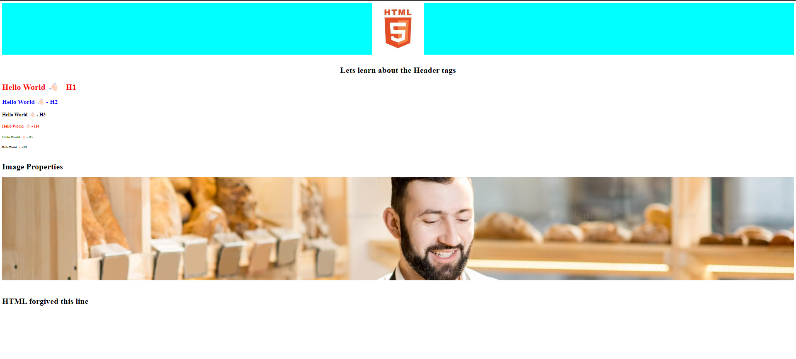

## Intro to Web Development

### Browser Wars
1st Browser War is between Netscape and Internet Explorer
2nd War is between Ie and Chrome

## 3-Layer Architecture
- FrontEnd
    - Angular
    - React
- BackEnd
    - Python
    - Java
    - Node

- DataBase

## Why 3-Layer
- Loosely coupled
  - Means having flexibility of different FE or BE or DB.
- Performance agnostic
- Micro-service architechture
  - Netflix is leading company in this.

## Selectors :
```css
    /* Element selector */
      h2 {
        color: blue;
      }
      /* Class Selector 
        It has advantage as we can re-use the code*/
      .fun {
        color: red;
      }
```

## Output


[Squoosh - Image Editor](https://squoosh.app/)  
To reduce the size ann maintain the quality - webp format helps alot.  
  
## To Analyze the Page Load and SEO ratings


>The concept of SVG(Scalable Vector Graphics) based on the equation of circle.  
x^2 + y^2 = r^2

## 5 pillars of Code Quality
1. Readability - 75% you will be reading the codes
2. Maintainability - Code Debt //Task postponement continuously
3. Extensibility
4. Testability
5. Performance