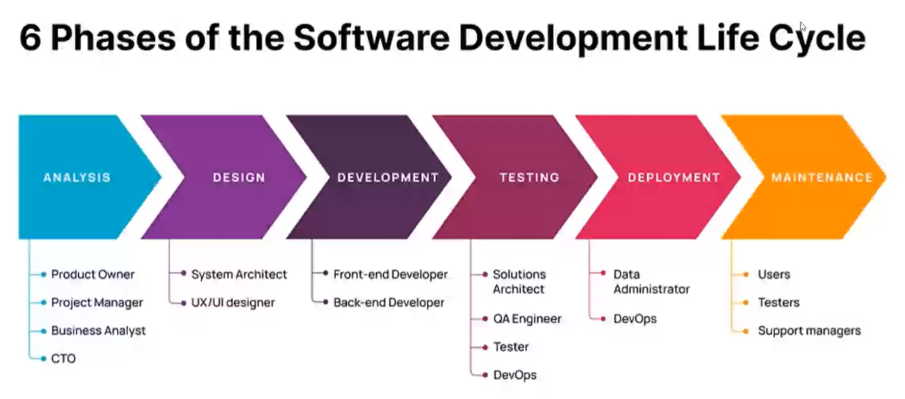
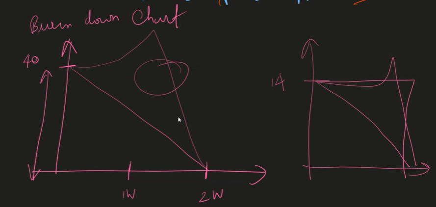

# Software Development Life Cycle

## Stages in SDLC

1. Planning  
What to be done and tasks are assigned to the developers. Developers provide the storypoints and then manager prioritize them.  
Priority will be p0 to p3
2. Analysis  
Business and Technical analysis will be done
3. Design  
Design team designs the web pages required and manager finalizes them
4. Implementation  
Developers work on the tasks
5. Testing & Integration  
After development, QA tests the code
6. Maintainance  
Support team helps in maintainance to defer the tickets

## Stake Holders

If anything goes wrong in the product, these people are responsible



### System Architect

Lays down the foundation required for the project. Like what tech stack should be used? How it should be build? etc. These things are managed by the SA.

## Kan-ban Board
We will be having the columns/categories in the board  
Backlog | InProgress | Done  |
-------|-------------|----- |
tasks in that sprint| Developers working on the tasks | Tasks that are completed
 
Reviewer :   
Reviews the code quality of the completed tasks

### Burn Down Chart

This is used by managers to track the work progress



## Code Standards

For variables and function names, camelCase should be used and for Class PascalCase should be used.
These are meant to have uniformity through out your code base.

- Code Quality
- DRY

### Variable name

- camelCase

```js
let stud_name = "xyz"; //❌
let studentName = "abc";
```

- Understandable / Descriptive

```js
let a = 50; //❌
let age = 50;
```

- Choose 'let' over 'var', 'const' over 'let'

## Documentation
- Single Line Comments
```js
// single Line Comment
```
- Multiple Line Comments
```js
/**     2 star is for js doc comment
 * Multi
 * Line
 * Comment
 */
```

### ESLint
- To enforce code standards